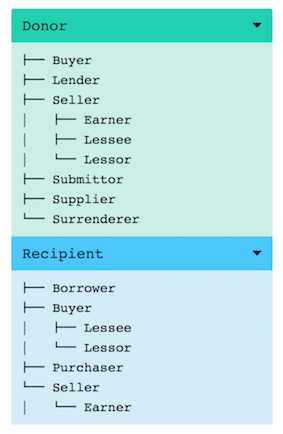

# Welcome to myValencer's manual!

myValencer is a free and opensource web application to query valence patterns in FrameNet.

Help us improve it by reporting bugs
or requesting features on [Github](https://github.com/akb89/myValencer/issues)
or by contacting us via [email](https://aemail.com/lE1).

myValencer currently supports the following functionalities:

* **Annotations**: displays all annotated sentences exemplifying an input valence pattern.
* **Frames**: displays all frames which contain at least one lexical unit which arguments are
realized in a specified input valence pattern.
* **Lexical units**: displays all lexical units which arguments are realized in a specified
input valence pattern.
* **Cluster**: displays the cluster of frames matching an input valence pattern, with their respective (frame) relations.

!!! warning
    This manual contains references to FrameNet concepts
    necessary to use myValencer.
    Details regarding those concepts -- as reproduced in this manual -- may contain errors or approximations.
    For an accurate and exhaustive overview of FrameNet concepts, always refer to the
    [FrameNet book](framenet_book.pdf).

## What is a *valence pattern*?

A *valence pattern* refers to the range of combinatorial possibilities of
valences for each lexical unit, where *valences* are the syntactic
realizations
of frame elements, represented as triplets of frame element (FE),
phrase type (PT) and grammatical function (GF).

The following sentence provides an example of FrameNet annotation for the valence
pattern `Fluid.NP.Ext Goal.PP.Dep Source.PP.Dep` where the predicate
`spill.v` evokes the `Fluidic_motion` frame:


Here, the `Fluid` FE is realized as the subject `Ext` of a noun phrase `NP`,
and the `Goal` and `Source` FEs are realized as objects `Dep` of prepositional
phrases `PP`.

You can find [a summary of FrameNet's PT and GF below](#pt-gf-overview).
For a detailed account, refer to the [FrameNet book](framenet_book.pdf).
For a detailed
account of Frame Elements, you can browse the
[Frame Index](https://framenet.icsi.berkeley.edu/fndrupal/frameIndex) on
the FrameNet website.


## Query HowTo
myValencer is designed to take as input combinations of FE.PT.GF
triplets, such as:
```
Fluid.NP.Ext Goal.PP.Dep Source.PP.Dep
```
The above query will return all annotation sets containing at least the
three distinct Frame Elements `Fluid`, `Goal` and `Source` in their specified
syntactic realizations. Valences must be separated by a whitespace and triplets
FE.PT.GF in a single valence are separated by a dot.

Combinations of valences are **orderless**, so the above query is equivalent to:
```
Goal.PP.Dep Fluid.NP.Ext Source.PP.Dep
```
Similarly, triplets inside a given valence are also **orderless**, so
that `Goal.PP.Dep` is equivalent to `PP.Goal.Dep` or to `Dep.PP.Goal`.

Queries are also **case-insensitive**, so the above queries are equivalent to:
```
fluid.np.ext goal.pp.dep source.pp.dep
```

Finally, the query system is **flexible** and accepts combinations of one, two or
three elements per valence, such as:
```
Goal Fluid.Ext Source.PP
```
The above query will search for annotations containing a `Goal` FE in any
possible syntactic realization (PT.GF), a `Fluid` FE realized as an external
argument in any kind of phrase type, and a `Source` FE realized in a
prepositional phrase with any kind of grammatical function.

## Use cases

Below are some possible use case for myValencer:

### Analyzing the *semantic scope* of syntactic constructions
myValencer can be used to analyze the 'semantic scope' of a given syntactic construction by
querying for frames or lexical units matching the corresponding (syntactic) valence pattern.
For example, querying for the lexical units matching the
*prepositional indirect object construction* `NP.Ext NP.Obj NP.Dep` returns
349 unique lexical units found in 207 unique frames.

### Paraphrasing
myValencer can be used to search for paraphrasing candidates by querying lexical units
matching a given valence pattern, as FrameNet is characterized by relatively narrow-scope
frames and frame elements. For examples, querying for the lexical units matching
the vp `Fluid.NP.Ext Goal.PP.Dep Source.PP.Dep` corresponding to sentences such as
*Some of the wine spilled from the bottle to the floor*, returns lexical units
such as `drip.v`, `leak.v`, `splash.v` or `trickle.v`.

### Concordancing
myValencer can be used to extend the capabilities of traditional concordancers by enabling
searching for complex combinations of semantic and syntactic patterns, not bounded by specific
lexical items. Querying for annotations returns a list of annotated sentences matching a
given valence pattern, with the corresponding labels as well as all the relevant information
pertaining to the lexical unit and its frame.

## Options
There are two options than can be checked for each query:

### withExtraCoreFEs (default `true`)
Specifies whether or not valence patterns
containing other non-core frame elements beside those specified in input should
be included in the output results. Setting this option to `false` will return
only valence patterns containing the specified FE as core FEs, and only
non-core FEs as extra FEs.

### strictVUmatching (default `false`)
Specifies whether or not a *strict*
matching of valence units should be applied, tolerating extra non-core FEs or not.
Setting this option to `true` will not tolerate other non-core FEs and will
return only valence patterns matching exactly the specified valence units specified in input.

## Hierarchy
For users not necessarily familiar with the rich taxonomy of FrameNet frames
and frame elements, we have added two important features to the application:

### Frame Element Hierarchy
When querying for a given valence pattern containing a set of specified frame elements,
the `Annotations` tab will display on the right a toggle of frame element hierarchy
trees specifying, for each input frame element, the tree of its *children* (the
frame elements in an `Inheritance` FE-to-FE relationship with it).

For example, querying for `Donor.NP.Ext Recipient.PP.Dep` will display the
following trees for both the `Donor` and the `Recipient` FEs:




### Frame Hierarchy
Similarly, we have added, under each frame name on the `Frame` tab, the list of
the frame's *parents* (the frames with which the current frame is in an
`Inheritance` Frame-to-Frame relationship).

For example,


## PT GF overview
### PT labels

### GF labels
| Label  | Name | Details | Example |
| ------------- | ------------- | ------------- | ------------- |
| Ext  | External Argument  | | |
| Obj | Object | | |
| Dep | Dependent | | |
| Head | Head noun modified by attributive adjective | | |
| Gen | Genitive determiner | | |
| Appos | Appositive | | |

## Mapping to UD and PENN
